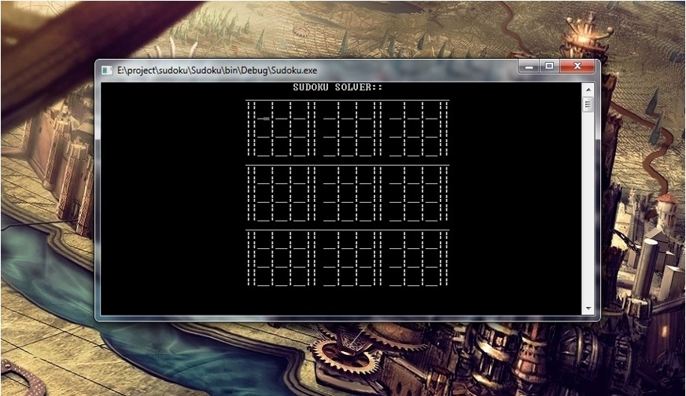
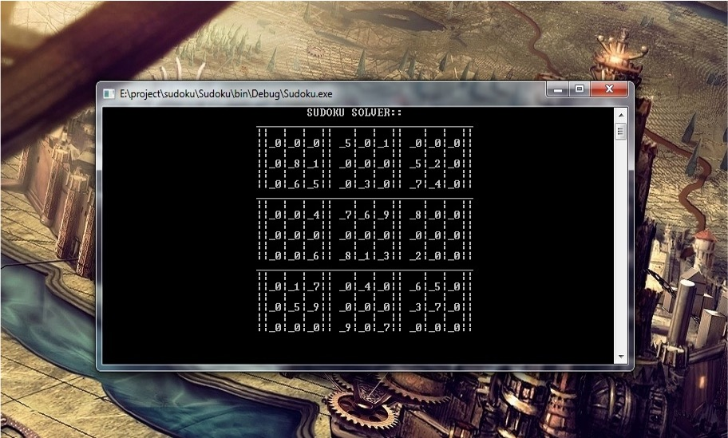
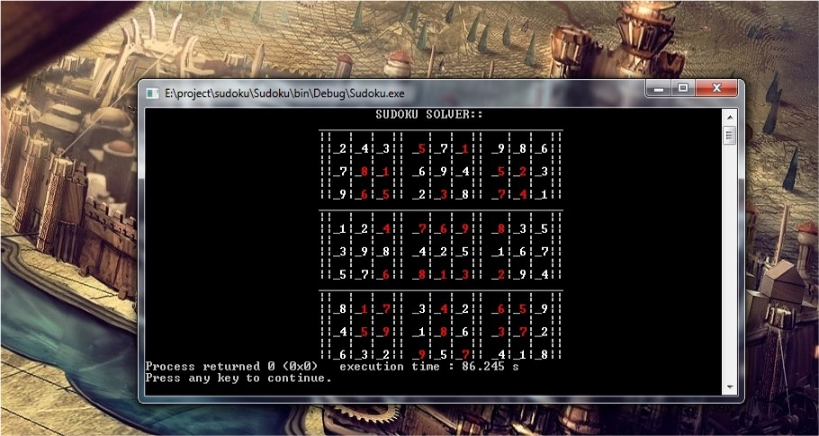

# Sudoku Solver

## Abstract

Do you solve Sudoku in your leisure time? Don't you get frustrated with those newspapers
who post solutions only a week after? Well fret not, Sudoku solver solves your Sudoku in a matter of seconds using
depth-first backtracking. Just enter the question in order and fill the blank spaces with ``0``. Press ``enter`` and viola ! There you have it, the solution to your Sudoku puzzle. 

## About Sudoku 

Sudoku is a Japanese puzzle game. It means “Single Number” or “Number Place”. The game consists of a 9x9 grid, which is divided into nine 3x3 grids (called boxes or sub-grids).  When the game begins, a player will be provided with random numbers in random cells. The objective is to fill the empty cells with a number from 1 to 9 in the shortest time. To
complete the Sudoku puzzle, each cell must be filled such that

1. Each number must only occur in a column once.
2. Each number must only occur in a row once.
3. Each number must occur in a sub-grid only once.

## Build instructions

Open the CodeBlocks project ``Sudoku.cbp`` and build.

## Screenshots

